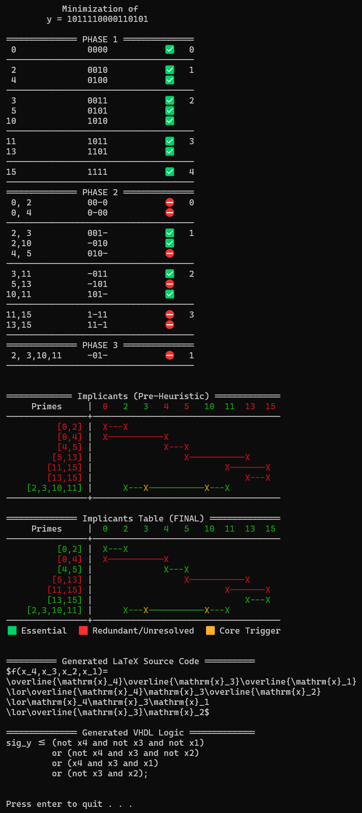

# Quine-McCluskey Logic Minimizer (Heuristic Optimized) (C++20)

    

A high-performance, hardware-aware C++20 command-line tool designed to minimize Boolean functions using the **Quine-McCluskey Tabular Method**. Beyond raw logic reduction, this software serves as an educational simulator and a digital grading assistant. It visualizes every grouping phase exactly like an engineer would on paper and directly exports production-ready VHDL code and mathematical LaTeX strings.

---

## 💡 Design Philosophy: Human-Readable & Educational

Instead of compressing the Quine-McCluskey algorithm into an opaque, bitwise "black box," this implementation is designed as a visual simulator. It mirrors the exact chronological steps a human engineer takes when solving the problem on paper.

* **Step-by-Step Visualization:** By utilizing structured associative containers (`std::map`, `std::set`), the program preserves and beautifully formats the intermediate states of the Prime Implicant charts.
* **Deterministic Heuristics:** The dual-table output explicitly demonstrates the transition from initial core-implicant detection to the final greedy-heuristic elimination of **NP-hard** cyclic core problems.
* **Educational Focus:** This approach makes the code highly maintainable, auditable, and a perfect tool for understanding the underlying discrete mathematics of logic minimization.

---

## 🚀 Key Features & Architectural Knocks

* **Exact Tabular Simulation:** Processes Phase 1 (Minterm Grouping), Phase 2 (Prime Implicant Discovery), and Phase 3 (Essential Implicant Selection) with colored CLI tables, emojis, and comprehensive legends.
* **Advanced Heuristic Solver for NP-Hard Cores:** When encountering a cyclic core, the engine deploys a highly optimized, fair candidate elimination system instead of a naive "first-fit" selection:
  1. *Single Uncovered Term:* Selects the prime implicant with the *minimal span* to save logic gates.
  2. *Multiple Uncovered Terms:* Selects the candidate with the *widest covering span*.
  3. *Span Tie-Breaker:* Chooses the candidate closest in mathematical proximity to the target term.
  4. *Final Tie-Breaker:* Strict deterministic fallback to the first evaluated implicant.
* **Instant VHDL Logic Generator:** Generates clean, syntactically correct concurrent VHDL signal assignments (`and`, `or`, `not`) with customizable signal names—ready for immediate deployment in FPGA tools like AMD Vivado or Intel Quartus.
* **Instant LaTeX Export:** Outputs the minimized Boolean equation as a beautifully formatted LaTeX string, optimized for scientific papers, assignments, or documentation.
* **Cross-Platform CLI Comfort:** Identical execution and formatting across **Windows** and **Linux** (e.g., CachyOS) with robust error-handling.
* **Rigorous Input Validation:** The `main()` entry point thoroughly audits all command-line arguments, verifying that the input string strictly adheres to a binary truth-table length ($2^x$, where $x \in$ `size_t`) before memory allocation.

---

## 📂 System Architecture & Code Structure

The project follows a strict functional separation of concerns with a heavy focus on data encapsulation. Instead of leaking internal logic, the implementation ensures that structural implementation details remain completely hidden from the execution layer:

```
Quine_McCluskey/
├── image/
│   └── output_example.png  # Comprehensive terminal execution showcase (Phases, Solver, LaTeX & VHDL)
├── src/
│   ├── QMC.h               # Global constexprs, declarations & encapsulated structures
│   ├── QMC.cpp             # Engine definition (Phases, Heuristics, CLI routing & Rendering)
│   └── main.cpp            # Application entry point & truth-table size-validation
├── .gitignore              # Specifies intentionally untracked files to ignore
├── LICENSE                 # MIT License File
└── README.md               # Project documentation and architecture overview
```

* **`QMC.h`**: Contains global compile-time constants (`constexpr`) and explicit forward declarations. Crucially, internal data structures like the `Min_Term` struct are fully encapsulated and hidden from the outside world.
* **`QMC.cpp`**: The central powerhouse of the application. It contains all definitions and completely orchestrates the Quine-McCluskey pipeline, including phase processing, table building, the candidate heuristic solver, CLI routing, VHDL/LaTeX code generation and terminal formatting.
* **`main.cpp`**: Acts as the strict, lightweight entry point of the software, handling initial input validation and triggering the execution pipeline.
* **`image/`**: Contains the full-scale terminal capture demonstrating the complete optimization pipeline — including tabular reduction phases, heuristic core-solving, and the generated LaTeX and VHDL outputs.

---

## 🛠️ Compilation, Build & Usage

This project has no external dependencies and relies purely on the C++ Standard Library. The logic is encapsulated across clean header and source boundaries, making compilation straightforward.

### Prerequisites
* A modern C++ compiler supporting **C++20** (e.g., `g++` 11+, `clang` 13+, or MSVC latest).

### 🚀 Quick Start (Build & Compile)
To clone, compile, and prepare the executable on Linux or Windows (via MinGW/WSL), run the following commands in your terminal:

```bash
# Clone the repository
git clone https://github.com/iibram/Quine_McCluskey.git

# Change directory
cd Quine_McCluskey

# Build using g++ with O2 Optimization flag
g++ -std=c++20 -O2 src/*.cpp -o qmc_demo

# Run the app
./qmc_demo
```

### 💻 Execution & CLI Arguments
The compiled executable expects targeted parameters at launch to ensure a strict separation of configuration and execution logic:

```bash
./qmc_demo <y_bitstring> [vhdl_signal_name]
```

* **`argv[1]` (`y_bitstring`):** The output vector of your truth table, passed as a continuous binary string (e.g., 1011110000110101). The string length must be an exact power of 2, theoretically limited only by your system's available RAM.
* **`argv[2]` (`vhdl_signal_name`):** *Optional.* Defines the identifier for the exported VHDL signal assignment. Defaults to "sig_y".

---

## 📊 Terminal Output Showcase

When feeding the application with the 16-bit sequence "1011110000110101", it effortlessly walks through the reduction steps and generates the following terminal feedback:

<p align="center">
	
</p>

### Resulting Mathematical Expression

$$
\begin{aligned}
f(x_4,x_3,x_2,x_1)=
\overline{\mathrm{x}_4}\overline{\mathrm{x}_3}\overline{\mathrm{x}_1}
\lor\overline{\mathrm{x}_4}\mathrm{x}_3\overline{\mathrm{x}_2}
\lor\mathrm{x}_4\mathrm{x}_3\mathrm{x}_1
\lor\overline{\mathrm{x}_3}\mathrm{x}_2
\end{aligned}
$$

---

> ## ⚠️ VHDL Design Note
> While the generated VHDL code is fully syntactical and ready to run, this tool is meant to assist structural planning. In professional FPGA engineering, relying on overly deep, unpipelined combinatorial logic strings can degrade timing performance. Use the output responsibly as part of a well-designed synchronous architecture.

---

## 📄 License
This project is licensed under the MIT License - see the [LICENSE](LICENSE) file for details.
