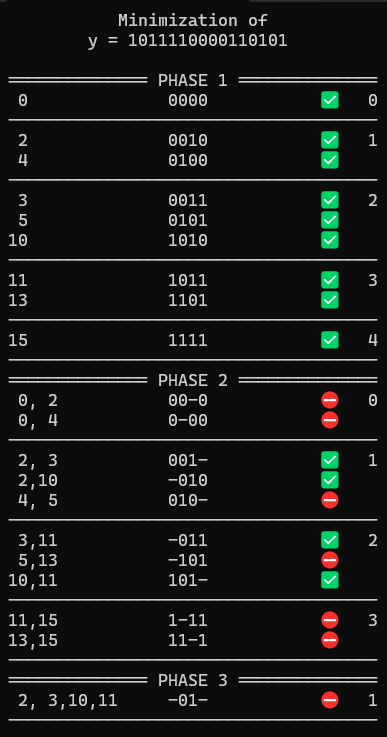
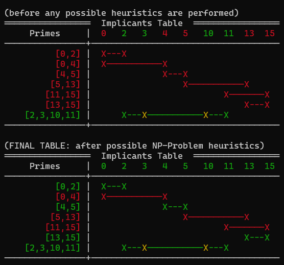
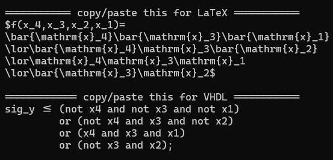

# Quine-McCluskey Demonstrator (C++20)

## Design Philosophy: Human-Readable & Educational

Instead of compressing the Quine-McCluskey algorithm into an opaque, bitwise "black box," this implementation is designed as a visual simulator. It mirrors the exact chronological steps a human engineer takes when solving the problem on paper.

* **Step-by-Step Visualization:** By utilizing structured associative containers (`std::map`, `std::set`), the program preserves the intermediate states of the Prime Implicant charts.
* **Heuristics in Action:** The dual-table output explicitly demonstrates the transition from the initial core-implicant detection to the final greedy-heuristic elimination of the NP-hard cyclic core problem.
* **Educational Focus:** This approach makes the code highly maintainable, auditable, and a perfect tool for understanding the underlying discrete mathematics of logic minimization.

---

Ein leistungsstarkes, hardwarenah gedachtes C++ Werkzeug zur Minimierung boolescher Funktionen mithilfe des **Quine-McCluskey-Verfahrens**. Das Tool optimiert unvollständig oder vollständig spezifizierte Logikfunktionen und liefert neben der schrittweisen Visualisierung der Reduktionsphasen auch direkt fertige Code-Exporte für Hardware-Entwickler und akademische Arbeiten.

## 🚀 Highlights & Features

* **Vollständige Phasen-Visualisierung:** Das Tool schlüsselt die Optimierung transparent in Phase 1 (Minterm-Gruppierung), Phase 2 (Primimplikanten-Ermittlung) und Phase 3 (Finale Minimierung) auf.
* **Intelligente Kern-Minimierung (NP-Problem Lösung):** Bei der finalen Auswahl der Primimplikanten nutzt das Tool keine banale "First-Fit"-Selektion. Es evaluiert die mathematisch beste Entscheidung zur Überdeckung, um die absolut minimalste Logikfunktion zu garantieren.
* **Direkter VHDL-Export:** Generiert sofort einsatzbereite, syntaktisch korrekte VHDL-Signalzuweisungen (`not`, `and`, `or`), die direkt per Copy-and-Paste in FPGA-Projekte (z.B. in Vivado oder Quartus) übernommen werden können.
* **Direkter LaTeX-Export:** Spuckt die minimierte Funktion als formatierten mathematischen String für den sofortigen Einsatz in wissenschaftlichen Dokumenten oder Hausarbeiten aus.
* **Modernes C++20 & CLI-Komfort:** Nutzen von modernem C++ (vollständige Header-/Source-Trennung, saubere Kapselung) und interaktive Parameterübergabe direkt beim Start.

## 📊 Beispiel-Ausgabe

Wenn dem Programm beispielsweise die Bitkette `"1011110000110101"` übergeben wird, generiert es folgenden detaillierten Ablauf im Terminal:

	

	

	

$$
\begin{aligned}
f(x_4,x_3,x_2,x_1)=
\bar{\mathrm{x}_4}\bar{\mathrm{x}_3}\bar{\mathrm{x}_1}
\lor\bar{\mathrm{x}_4}\mathrm{x}_3\bar{\mathrm{x}_2}
\lor\mathrm{x}_4\mathrm{x}_3\mathrm{x}_1
\lor\bar{\mathrm{x}_3}\mathrm{x}_2
\end{aligned}
$$
